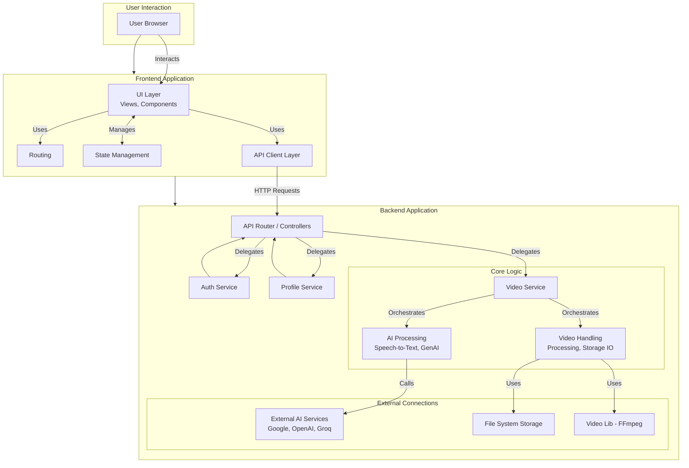

# AI Video Editor

A web application for editing videos with AI-powered features.

## Architecture Overview

This project follows a client-server architecture:

*   **Frontend:** A [Nuxt 3](https://nuxt.com/) application (`frontend/`) responsible for the user interface and user interactions.
*   **Server:** A [Node.js](https://nodejs.org/) backend (`server/`) built with the [`@modular-rest/server`](https://www.npmjs.com/package/@modular-rest/server) framework, handling business logic, AI processing, video manipulation, and API requests.



## Technology Stack Summary

*(See individual READMEs for full details)*

*   **Frontend:** Nuxt 3, Vue 3, TypeScript, Pinia, Tailwind CSS, Video.js, `@modular-rest/client`
*   **Server:** Node.js, `@modular-rest/server`, LangChain, Google Cloud AI/Speech, OpenAI, Groq, `fluent-ffmpeg`, Zod

## Prerequisites

*   **Node.js:** Version `20.9.0` (Check `.nvmrc` file in the root)
*   **Yarn:** Package manager (Uses `yarn.lock` in both `frontend` and `server`)
*   **API Keys:** For services like Google Cloud, OpenAI, Groq (configured via `.env` files in `server/`)
*   **Google Cloud Credentials:** Service account JSON file (placed at `server/google-credentials.json`)
*   **FFmpeg:** Must be installed on the server environment for video processing.

## Getting Started

Follow these steps to set up and run the project locally:

1.  **Clone the repository:**
    ```bash
    git clone <your-repository-url> # Replace with the actual repository URL
    cd ai_video_editor
    ```

2.  **Install Dependencies:**
    Install dependencies for both the frontend and the server using Yarn:
    ```bash
    # Install frontend dependencies
    cd frontend
    yarn install

    # Install server dependencies
    cd ../server
    yarn install

    # Return to the root directory (optional)
    cd ..
    ```

3.  **Configure Environment Variables:**
    This project requires API keys and other configuration settings managed through environment variables.
    *   **Frontend:** Copy the sample environment file:
        ```bash
        cp frontend/.env.sample frontend/.env
        ```
        Then, edit `frontend/.env` and fill in the required values (e.g., API base URL for the server).
    *   **Server:** Copy the sample environment file:
        ```bash
        cp server/.env.sample server/.env
        ```
        Then, edit `server/.env` and fill in the required API keys (Google Cloud, OpenAI, Groq) and other server settings.
        You will also need to place your Google Cloud credentials JSON file at `server/google-credentials.json` (or update the path in the server configuration if needed). *(Note: This file is gitignored)*

4.  **Run the Application:**
    You need to run both the frontend and server development servers concurrently. Open two separate terminal windows or tabs from the project root (`ai_video_editor`):

    *   **Terminal 1: Start the Frontend Server**
        ```bash
        cd frontend
        yarn dev
        ```
        The frontend should be accessible at `http://localhost:3000` (or the port specified by Nuxt).

    *   **Terminal 2: Start the Backend Server**
        ```bash
        cd server
        yarn dev
        ```
        The backend server will start, typically listening for API requests on a different port (check server logs or configuration).

## Detailed Documentation

*   **[Frontend Documentation](./frontend/README.md)**
*   **[Server Documentation](./server/README.md)** 